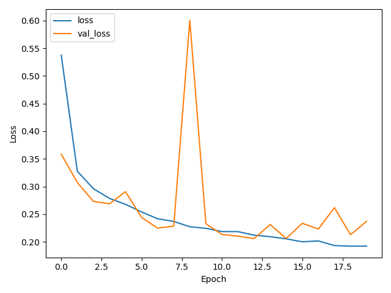
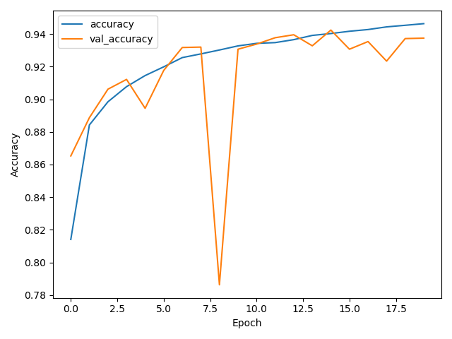

# Age-Gender Estimation based-on CNN

It classifies gender and age by taking face images as input. The technology used, is CNN(Convolutional Neural Network) and is still being refactored to improve the model.

## Library/Framework
- Keras
- Tensorflow
- OpenCV-Python

## Results from gender predictor

  

  

